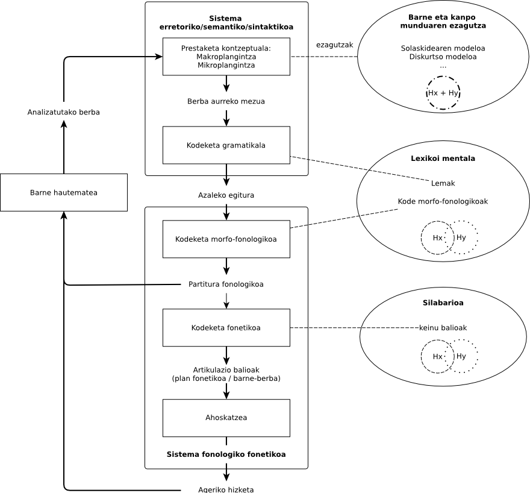
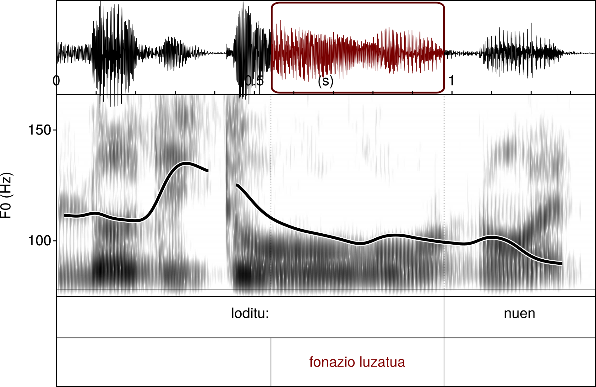

```{r setup, include=FALSE}
# INFO:
# Aparteko karpetan EUDIAko txantiloiak
# Aparteko karpetan datuak ./data
knitr::opts_chunk$set(echo = FALSE)

```


```{r prestaketa, include=FALSE}
library(readr)
EUDIA7 <- read_csv("./data/EUDIA7.csv", na = "NA")
library(vcd)
```

# Sarrera

Lan honetan erakusten da adizki jokatuaren elementuen sailkapen bat, zeinetan adizki nagusi perifrastikoak elementu erraztzat antzematen den eta adizki trinko zein laguntzaileek beste talde bat osatzen dutela ematen duen, adizkiaren alderdi zaila.

Aurkezten ditugun datuak ikerketa handiagoan ulertu behar dira, euskara ikastun batek ahozko ekoizpenean erakutsitako zailtasunaren analisian [@abasolo_zailtasunak_2017], hain zuzen. Lan horretan eta beste batzuetan [@abasolo_adizki_2015; @abasolo_desjariakortasuna_2016-2] erakutsia da zailtasuntzat har litezkeen errore, fonazio luzatu, errepikapen eta birformulazio zenbaitek antzerako portaera erakusten dutela.

Segidan aurkezten dugu Segalowitzek H2an egiten diren etorri etenen azterketarako aurkeztutako hizketaren modeloa [@segalowitz_cognitive_2010]; berez, Speaking liburuan Leveltek aurkeztutako bigarren modeloa [@levelt_speaking:_1989] eta de Bot-ek Levelt-en lehenengo modeloari iradoki zizkion H2rako egokitzapenekin ereikitakoa [@de_bot_bilingual_1992].


```{r levelt, echo=F, out.width = "70%", fig.cap="Levelten Hizketaren eredua H~2~ ere kontuan hartuta", fig.align='center', fig.pos="h"}

```

Modelo horren arabera, etorri-etenen eragileek asko eta toki askotan eragin lezakete, karratuetan aipatzen diren azpi-prozesu bakoitzean zein erdiko biribilaz irudikatzen den lexikoi mentaleko elementuak berreskuratzeko unean ere. Denera zazpi une identifikatu zituen Segalowitzek etorri-eten edo desjariakortasunak eragiteko. Gure interes berezikoak dira kodeketa gramatikalari eta lexikoi mentaletik berreskuratze unea, une horiek azal bailezakete, Abasolok 2017an aurkeztu zuen lanaren emaitza, bere corpusean zalantza eta bestelako zailtasun adierazleak adizki jokatuaren inguruan multzokatzea, alegia.

Zalantzazkoa da ea aditza jokatzearen ondorio den ala adizki jokatu zehatz bat berreskuratzeak eragiten dituen zalantza adierazleak eta bestelako zailtasun adierazleak. Kormosek dioenez, bigarren hizkuntza batean ari den ikastunak kodetze gramatikalik ez du eraikitzen, baizik eta elementuen formaren arabera aukeratzen ditu Lexikoi Mentalean [@kormos_speech_2006], irudian erdiko biribilean irudikatzen dena.

Hizketa ekoizte uneko ezaugarri dira zalantzak eta autozuzenketak, H1 zein H2 izan. Errakuntzak H1ean zein H2an ematen badira ere, H2ko gaitasun baxuko ikasleen ezaugarria dela ere esan ohi da. Ikerketa honetan darabilgun corpuseko datuetan zalantza, autozuzenketa eta erroreak aditz jokatuaren inguruan kokatzen dira.

Zailtasun adierazleen inguruko iritzi batasunik ez dagoela esan liteke. Guk lan honetan 
Zailtasun adierazletzat hartzen da zalantza adierazleetatik gramatika erroreetaraino dirauen continuuma, [@gaetanelle_errors_2011] lanetan iradoki eta [@abasolo_zailtasunak_2017] lanean sailkatu den moduan:

**Zailtasunen continuuma**

* Ahoskatu gabeak
    * Zalantza isilak
* Ahoskatuak
    * Zalantzak
        * Fonazio luzatuak
        * Silabaz silabako ahoskera
        * Errepikapenak
    * Erroreak
        * Hautemandakoak
            * Zuzendutakoak  
              Errepikapenak  
              Berba zatiak  
              Birformulazioak  
            * Zuzendu gabekoak
        * Hauteman gabekoak

Hurrengo irudian ikusten den zalantza adierazlea fonazio luzatua da, lan honetan zehatzen ikertu dugun adierazlea. Aurreko zerrendako hasierako elementuetako bat da fonazio luzatua. Irudiko zalantza adierazle hori adizki jokatuan kokatzen da, aditz nagusiaren alderdian, hain zuzen. Adizki laguntzailearen aurre-aurrean.

```{r echo=F, out.width = "70%", fig.cap="Fonazio luzatuaren irudi bat PRAAT erabilita", fig.align='center'}


```

Euskarazko aditz jokatuak zenbait ikertzaile liluratu du, ez dago besterik ingelesezko[^wikin] edo gaztelaniazko[^wikigaz] wikipediako artikuluen hasierak irakurtzea baino. Argiro azaltzen du MorenoCabrerak falazia batez ari garela hizkuntzaren konplexutasun gramatikalaz ari garenean [@moreno_cabrera_sobre_2007]. Oposizioak markatzen baitu aldearen tamaina, oposizioa egoteak ala ez egoteak [@newmeyer_measuring_2014], eta ez forma kopuruak.

[^wikin]: https://en.wikipedia.org/wiki/Basque_verbs
[^wikigaz]: https://es.wikipedia.org/wiki/Verbo_vasco

Beste alde batetik, euskarazko adizki jokatuak hainbat informazio barnebil ditzake, H~2~an trebatzen ari denean zailtasun eragile izan daitezkeena.

(@) <a id="etorzitezkeen"></a>Etor zitezkeen

(@) <a id="badago"></a>Badago

Goiko adibideetako kasuetan ikus dezakegu [lehenengo kasuan](#etorzitezkeen) adizki perifrastiko horretan adizki nagusiak baduela informa.zio semantikoa. Bigarrenak, adizki laguntzaileak, berriz, ia erabat erantsia du informazio semantikoa aditz nagusi gabe. Baina, era berean, informazio asko kodetu edo aukeratu behar da, baldin eta ikastunak horixe argi adierazi behar badu euskaraz. [Bigarren adibidean](#badago), berriz, batean ikusten dira adizkiaren informazio semantikoa, *egotea*, eta horri dagozkion modu, pertsona eta zenbaki informazioa.

EGA azterketako idatziaren analisian Pello Esnalek oso errakuntza gutxi aurkitu zituen 1988ko bere tesinan eta honela azaltzen zuen:

> aditzaren arloa dugu euskal hizkuntz formen artean egituratuenetarikoa
> 
> ---*[@esnal_erroreak_1988]*

Idatzitakoaren analisiak, zailtasunen continuumean, errakuntzen berri baino ezin liteke eman; horra ahozko jardunaren analisiak duen azalpen ahalmen handiagoa.

### Corpusaren ezaugarriak

Gorago esan bezala, lan honetarako [@abasolo_zailtasunak_2017] laneko datuak erabiltzen dira. Datuak urtebetean zehar batu ziren, 2014-2015 ikasturtean. Horretarako ikastunari grabatu zitzaizkion zenbait ahozko ariketa, aurrez prestatutako mologoa egitean dautzana.

Ikerketa honetarako propio garatutako transkribatze eta etiketatze sistema erabili zen [@abasolo_transkribatze_2015]. Kodeketa horretan grafema bakarreko edo biko etiketak erabili ziren zailtasun adierazle bakoitza identifikatzeko, baita zenbait ezaugarri morfosintaktiko nabarmentzeko ere. Bigarren pausu batean, 
etiketen multzokatze motak nola banatzen diren ikusteko bidea ematen du kodetutako testuaren azterketak.

| esaldia: | \@&aelig; *jakiteko betebeharrak* | $ *betetze:n*   | ¡ *duten* \*2         |
| -------- | ----------------------- | ------------- | ------------------- |
| etiketak |                         | luzatua0      | luzatua1            |
|          |                         |               | errorea (eza)       |
|          |  aditz argmentua ABS    | aditz nagusia | adizki laguntzailea |

Table: Testu eta etiketen adibidea

Corpusaren ezaugarri kuantitatiboak aztertzeko, eurak laburtuta aurkezten dira hurrengo taulan


| 3057 berba                                                | 1325 zailtasun                                              |
| :---------------------------------------------------------| :---------------------------------------------------------- |
| 14 monologo                                               | 564 fonazio luzatu|
| 3057 berba                                                | 38 berba silabatze markatuaz|
| 467 adizki                                                | 275 osatu gabeko berba|
| *304 adizki nagusi perifrastiko / 278 adizki laguntzaile* | 66 errepikapen|
|189 adizki trinko                                          | 144 birformulazio|
|407 aditz argumentu                                        | ~~238 errore~~|
|64 Ezezko partikula                                        ||

Table: Aztertutako corpusaren ezaugarriak

Datuen ezaugarri morfosintaktikoen arabera aztertu dira zailtasunen banaketak, gehienetan, $\chi^2$arenarekin alderatuta. Horrela, aurkitu ahal izan dugu zenbait ezaugarrik badutela aditzen inguruko banaketa bereizia.

| Zailtasunen menpeko banaketak ($\chi^2$)|**_ez_** | **aditz nagusia** | **trinkoa** | **laguntzailea** |
| ------------------------------------------------- |:------:|:-----------------:|:-----------:|:----------------:|
| Fonazio luzatua                                   | **     | ***               | ***         | ***              |
| Fonazio luzatua aurrekoan                         |        |                   | ***         | ***              |
| Fonazio luzatua azkenaurrekoan                    |        |                   |             | *                |
| Berba zatiak ahozkatu dira aurretik               | **     |                   | ***         | *                |
| Aurrekoaren errepikapena                          | ***    | ***               | **          | ***              |
| Errepikapena hasi eta geroko lehenengo berba da   |        |                   | *           | **               |
| Birformulazioa bertan hasten da                   | **     |                   |             |                  |
| Birformulazioa hasi eta geroko lehenengo berba da |        |                   | **          | ***              |
| Zerbait falta du                                  |        |                   |             | ***              |

Table: Zailtasunen eta ezaugarri morfosintaktikoen banaketaren adierazgarritasun mailak, $\chi^2$ banaketaren arabera.

Aurreko taulan ikusten denez, corpus honetan adizki nagusiaren zein adizki laguntzaileen inguruan agertzen dira multzokatuta zailtasun adierazleak. Corpus horretako datuen beste analisi bat proposatuko dugu lan honetan.

# Hipotesiak

Gure hipotesi nagusia da aditz nagusiaren inguruan aurkitu diren zailtasunak ez dagozkiola Aditz Nagusiari berari, baizik eta Adizki Laguntzaileei. Eta hori hizketaren ekoizpenaren ezaugarri inkrementalak azal lezake.

H~1~: Zalantza adierazleen multzokatzeak adizki nagusietatik independenteak izango dira ezezko esaldietan.

H~2~: Bat datoz zalantza adierazleen banaketak adizki laguntzaile zein adizki trinkoen kasuetan.

H~3~: Aditz nagusien aspektuetatik independentea da zalantza adierazleen banaketa

# Metodologia

Zailtasunen agerrera euskarazko adizkien ezaugarriren batek ala zerk egiten duen zuzenean ezin aztertu daiteke corpusaren araketa hutsez; bai, ordea, hobeto ezagutu horien elkarreraginak. Horixe aztertzea helburu, hurrengo lerroetan aurkezten dugun lanerako ikusizko azterketa-teknikak erabili ditugu, *Visualizing Categorical Data* (VCD), baneketen ezaugarrien ulerkuntzan sakontzeko [@friendly_mosaic_1994].R estatistika lengoairako garatutako teknikak eta baliabideak erabili ditugu  [@meyer_strucplot_2006].

VCD teknikak tamainak erabiltzen ditu behatutako banaketen dimentsioak irudikatzeko, koloreak konparaketa adierazgarriak erakusteko eta tonalitateak aldearen indarra irudikatzeko.

Datuen banaketa mosaiko-grafiko batez irudikatzen du proportzioen berri hartzeko. Alderaketa kolorez irudikatzen du, $\chi^2$rekin egiten da alderaketa hori gure kasuan; kolore gorriz erakusten ditu banaketa idealean litzatekeena baino maiztasun gutxiago duten kategoriak eta kolore urdinez alderatutakoaren gainetiko maiztasuna duten kategoriak. Adierazgarritasunik erakusten ez duten multzokatzeetan grisa erabili dugu lanean. Koloreon intentsitatea erabiltzen da aldea handiagoa ala txikiagoa den erakusteko.

Aukera-arrazoia erabiltzeko joera dago 2x2 dimentsioetako alderaketak egiteko, guk, lan honetarako horren erabilera baino $\chi^2$rena lehenesten dugu arrazoi bigatik. Batetik, aukera-arrazoien indargunea banaketaren aurretiko ezagutzan oinarritzen delako eta corpuseko datuak ausaz hartu direlako. Beste alderdi batetik, aurrez egindako alderaketekin koherentzia gordetzeko, 2x2 taulok beste batzuen erredukzioa direlako.

# Emaitzak

Hiru lan hipotesiei dagozkien irudiak eta horien interpretazioak erakusten dira segidan, hurrenez hurren.

## Zalantza adierazleak eta adizki nagusiak independenteak dira ezezko esaldietan

```{r baietzNGvLZ0}
# Konparagaiak aukeratu eta taula sortu (baiezko esaldiak)
x <- subset(EUDIA7, EZEZKOESALDIA==0)
tx1 <- table(x$AD.NG, x$ZA.LUZ0)

dimnames(tx1) <- list('Fonazio Luzatua' = c("ez", "bai"),
                     'Aditz Nagusia' = c("ez", "bai"))

# Chi^2 
chtx1<- chisq.test(tx1)
```

Alderaketa hau egiteko, fonazioak luzatzeko uneak eta berben balio sintaktikoa alderatu dira, zehazki ea adizki nagusia ala beste zerbait diren. Kasu honetan alderatu behar dira elementuak konfigurazio bitan: baiezko eta ezezko esaldietan.

Lehenengo konfigurazioan, hau da, baiezko esaldietan banaketak $\chi^2$<sub>(`r chtx1$parameter`, N=`r sum(chtx1$observed)`)</sub> = `r round(chtx1$statistic,3)`, p = `r round(chtx1$p.value,5)` balioa du. Balio horrek zelako datu banaketa duen azpian `vcl` teknikak erabilita aztertu dugu.

```{r baietzNGvLZ0fig, fig.cap="Fonazio luzatuak eta aditz nagusien banaketa baiezko esaldietan", fig.pos="!ht"}
# Irudia
mosaic(tx1,gp = shading_hsv)
```

Irudian ikusten da, aditz nagusian fonazioa luzatzeko joera handia dela baiezko esasldietako aditz nagusietan. Izan ere, konfigurazio horretan etiketatutako fonazio luzatuen herenak aditz nagusian neurtu dira, nahiz eta oso kopuru txikia izan. Kolore gorri argiak adierazten du fonazio luzatuak aukera baxuagoa duela agertzeko aditz nagusia ez diren elementuetan. Irudikatutako .

```{r ezetzNGvLZ0}
y <- subset(EUDIA7, EZEZKOESALDIA==1)
ty1 <- table(y$AD.NG, y$ZA.LUZ0)

dimnames(ty1) <- list('Fonazio Luzatua' = c("ez", "bai"),
                     'Aditz Nagusia' = c("ez", "bai"))
chty1<- chisq.test(ty1)
```

Ezezko esaldietako adizki nagusietan, berriz, ez da aurkitu banaketa baldintzaturik ji karratuaren probaren bitartez: $\chi^2$<sub>(`r chty1$parameter`, N=`r sum(chty1$observed)`)</sub> = `r round(chty1$statistic,3)`, p = `r round(chty1$p.value,5)`.

Hala ere, irudi azterketa batek lagun lezake datuen banaketa moduak aztertzen, adierazgarritasunaren aurretik ere.

```{r ezetzNGvLZ0fig, fig.cap="Fonazio luzatuak eta aditz nagusien banaketa ezezko esaldietan"}
mosaic(ty1,gp = shading_hsv)
```

Irudian ikusten den banaketa ez esanguratsuak, nabarmentzekoa da, baiezko esaldietakoaren kontrakoa da. Hau da, zenbakietan ez da aurkitu baiezko esaldietako banaketaren antzik, adizki nagusian neurtutako fonazio luzatuei dagokienean.

## Fonazio luzatuaren banaketak adizki laguntzaile eta trinkoen kasuetan

Zati honetan ez da aztertzen ari ea fonazioa luzatu den ala ez adizkia ahoskatzeko unean, baizik eta ahoskatu aurretiko berban fonaziorik luzatu denentz, goiko [irudian](#Fonazio-luzatuaren-irudi-bat-PRAAT-erabilita) moduan.

```{r trinko}
tlagluz1 <- table(EUDIA7$AD.LAGUNTZAILEA, EUDIA7$ZA.LUZ1)
dimnames(tlagluz1) <- list('Aurrekoa Luzatua' = c("ez", "bai"),
                     'Aditz Laguntzailea' = c("ez", "bai"))

chtlagluz1 <- chisq.test(tlagluz1)
```

**Adizki laguntzaileen** kasuan fonazio luzatuaren banaketa ez da independentea, espero izatekoa zitekeena. Honelako balioa hartzen du $\chi^2$<sub>(`r chtlagluz1$parameter`, N=`r sum(chtlagluz1$observed)`)</sub> = `r round(chtlagluz1$statistic,3)`, p = $`r chtlagluz1$p.value`$. Honetan \(\chi^2\)k hartzen duen balioaren norabidea eta tamainak aztertzeko mosaiko-grafikoa eraiki da.

```{r trinkofig, fig.cap="Fonazio luzatua aurrekoan eta aditz laguntzailea"}
mosaic(tlagluz1,
       gp = shading_hsv)
```

Irudiak nabarmentzen du koadranteetako bakarrean aurkitu direla emaitza adierazgarriak, banaketa independentea ez dela erakusten duena. Hain zuzen, aditz laguntzaileen kasuan, aurreko hitzean fonazio luzatua aurkitzeko aukerak handiagoak dira aztergai darabilgun banaketa estatistikoaren arabera espero litekeena baino.

```{r laguntzaile}
ttrinluz1 <- table(EUDIA7$AD.TRINKOA, EUDIA7$ZA.LUZ1)
dimnames(ttrinluz1) <- list('Aurrekoa Luzatua' = c("ez", "bai"),
                     'Aditz Trinkoa' = c("ez", "bai"))

chttrinluz1 <- chisq.test(ttrinluz1)
```

**Adizki trinkoen** inguruko azterketan ere menpekotasuna aurkitu dugu honelako balioarekin: $\chi^2$ <sub>(`r chttrinluz1$parameter`, N=`r sum(chttrinluz1$observed)`)</sub> = `r round(chttrinluz1$statistic,3)`, p = $`r round(chttrinluz1$p.value,5)`$. Horrek adierazten du adizki trinkoen aurreko hitzean fonazio luzatua aurkitzeko aukerak eta adizki jokatu trinkoak harremanetan daudela. Norabideak eta tamainak aztertzeko mosaiko-grafikoa erabili da

```{r laguntzailefig, fig.cap="Fonazio luzatua aurrekoan eta aditz trinkoak"}
mosaic(ttrinluz1, 
       gp = shading_hsv)
```

Irudiaren azterketak erakusten du adizki trinkoen kasuan fonazio luzatua aurreko hitzean aurkitzeko aukerak handiagoak direla bestelako kasuetan baino.

### Aditz nagusiaren aspektua eta fonazio luzatua

```{r adnagaspek}
tadnagaspluz0 <- table(EUDIA7$AD.NG.Q.ASP,EUDIA7$ZA.LUZ0)[-3,]
dimnames(tadnagaspluz0) <- list(Aspektua = c("bakoa", "burutua", "ez burutua", "geroa"),
                     'Fonazio Luzatua' = c("ez", "bai"))

chtadnagaspluz0 <- chisq.test(tadnagaspluz0)
```

Aditz nagusiari eragiten zaion gramatika marka dugu aspektua, aditz aspektua zein den baliteke fonazio luzatuaren agerrerak menpeko banaketa izatea. Banaketa horren emaitzen argitara, $\chi^2$<sub>(`r chtadnagaspluz0$parameter`, N=`r sum(chtadnagaspluz0$observed)`)</sub> = `r round(chtadnagaspluz0$statistic,3)`, p = `r round(chtadnagaspluz0$p.value,5)` ez dago horrelakorik esaterik.

Era grafikoan ere azter daiteke banaketa hori, hipotesi berri edo bestelako informazioaren bila.

```{r adnagaspekfig, fig.cap="Fonazio luzatua aditz nagusietan, aspektuen arabera"}
mosaic(tadnagaspluz0, gp = shading_hcl, split_vertical = T)
```

Begizko azterketa batean ikus dezakegu aspektu bako aditz nagusietan, maiztasunik baxuena dutenak, fonazio luzatuaren gertaldiak gutxiago direla, maizen ikusi den aspektu ez burutuan baino. Aspektu burutu eta geroan, berriz, pareko banaketa du ezaugarriak.

# Ondorioak

Aurkeztu diren emaitzen argitara planteatu diren hiru lan hipotesiak bete dira. Aditz nagusian aurkitu diren fonazio luzatuen menpeko banaketa baiezko esaldietan aditz nagusiak aditz laguntzailearekiko hartu ohi duen kokapenak baldintzatua dela ondoriozta daiteke. Ezezko esaldietan ikusten den portaera erabat bestelakoak argi uzten du funtzio sintaktiko horretatik independentea dela ezaugarri hori.

Antzerako jokaera ikusi dugu fonazio luzatuaren agerrera adizki laguntzaile edo trinkoen presentziaren aurrean. Horrek pentsa arazten du funtzio desberdin bi horiek osotasun bat dutela corpuseko informatzailearen prozesamenduan.

Aditz nagusi perifrastikoaren funtzio sintaktikoan gramatika elementu bakarra agertzen da aztergai, aspektu marka edo marka eza. Horren araberako analisiak ez digu erakutsi aspektu markaren araberako oposizioak ezelako loturarik duenik zailtasunen agerrerarekin.

Ez dago argi, corpusaren analisi huts honetan aztertuta, ea zerk eragiten duen zailtasuna, aditza jokatzeak ala aditz jokatuko formak berreskuratzeak. Lan honetan zailtasuna zailtasun eragilea identifikatzera hurreratu gara eta euskara H2 berantiar honen prozesamendua ulertzera ere hurreratu gara. Zer zehaztu ere definitu ahal dugu: ea aditza jokatzea ala aditz formak berreskuratzea den zailtasun eragilea (ala bien arteko zelanbaiteko elkarreragina).

Hurrengo lan batzuetan alderatu daitezke formen maiztasuna eta zailtasunak, ea formen zailtasuna maiztasunarekin lotuta dagoen aztertzeko ala ea aditz inflexioaren presentziak; beraz, funtzio sintaktiko horrek azaltzen duen ikusteko.
Corpusa zabaltzeak ere emaitza orokorgarriagoak ekar litzake, beraz, corpusa beste hiztun batzuetara zabaltzea ere gomendatzen dugu.

# Erreferentziak


