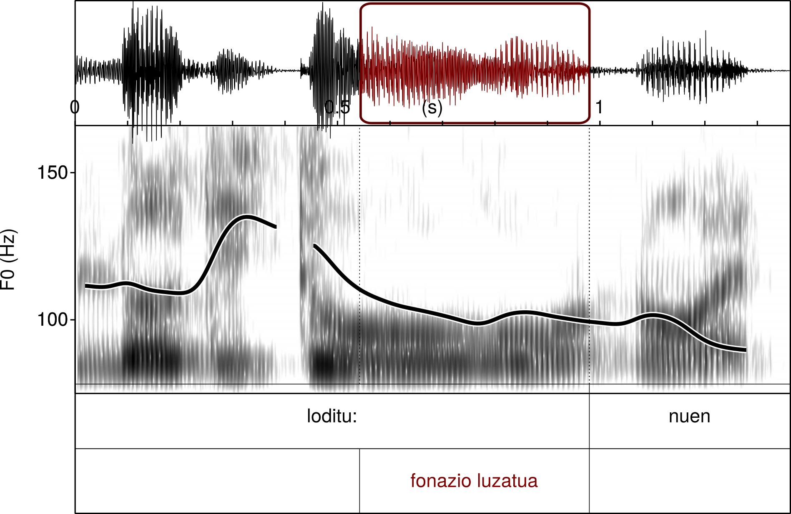

Sarrera
=======

Lan honetan erakusten da adizki jokatuaren elementuen sailkapen bat, zeinetan adizki nagusi perifrastikoak elementu erraztzat antzematen diren eta adizki trinko zein laguntzaileek beste talde bat osatzen dutela ematen duen, adizkiaren alderdi zaila.

Aurkezten ditugun datuak ikerketa handiagoan ulertu behar dira, euskara ikastun batek ahozko ekoizpenean erakutsitako zailtasunen analisian (Abasolo, 2017), hain zuzen. Lan horretan eta beste batzuetan (Abasolo, 2015a, 2016) erakutsia da zailtasuntzat har litezkeen errore, fonazio luzatu, errepikapen eta birformulazio zenbaitek antzerako portaera erakusten dutela.

Segidan aurkezten dugu Segalowitzek bigarren hizkuntzan (H2) egiten diren etorri etenen azterketarako, aurkeztu zuen hizketaren modeloa (Segalowitz, 2010); berez, Speaking liburuan Levelt-ek aurkeztutako bigarren modeloa (Levelt, 1989) eta de Bot-ek Levelten lehenengo modeloari iradoki zizkion H2rako egokitzapenekin eraikitakoa (De Bot, 1992).

Levelten Hizketaren eredua H2 ere kontuan hartuta

Modelo horren arabera, etorri-etenen eragileek asko eta toki askotan leukakete haien eragina, karratuetan aipatzen diren azpi-prozesu bakoitzean zein erdiko biribilaz irudikatzen den lexikoi mentaleko elementuak berreskuratzeko unean ere. Denera zazpi une identifikatu zituen Segalowitzek etorri-eten edo desjariakortasunak eragiteko. Gure interes berezikoak dira kodeketa gramatikalaren unea eta lexikoi mentaletik berreskuratzekoa, une horietan kokatzen direlako aztergai dugun Abasolo 2017ko corpuseko zenbait zalantza eta bestelako zailtasun adierazleak, adizki jokatuaren inguruan multzokatzen direnak, alegia.

Zalantzazkoa da ea aditza jokatzearen ondorio den ala adizki jokatu zehatz bat berreskuratzeak eragiten dituen zalantza adierazleak eta bestelako zailtasun adierazleak. Kormosek dioenez, bigarren hizkuntza batean ari den ikastunak kodetze gramatikalik ez du eraikitzen, baizik eta elementuen formaren arabera aukeratzen ditu Lexikoi Mentalean (Kormos, 2006), @ref(fig:levelt). irudian erdiko biribilean irudikatzen dena.

Hizketa ekoizte uneko ezaugarri dira zalantzak eta autozuzenketak, H1 zein H2 izan. Errakuntzak H1ean eta H2an ematen badira ere, H2ko gaitasun baxuko ikasleen ezaugarria dela ere esan ohi da. Ikerketa honetan darabilgun corpuseko datuetan zalantza, autozuzenketa eta erroreak aditz jokatuaren inguruan kokatzen dira (Abasolo, 2017).

Zailtasun adierazleen inguruko iritzi batasunik ez dagoela esan liteke. Guk lan honetan zailtasun adierazletzat hartzen dugu zalantza adierazleetatik gramatika erroreetaraino dirauen continuuma, (Gaëtanelle & De Cock, 2011) lanean iradokitzen eta (Abasolo, 2017) lanean sailkatu den moduan:

**Zailtasunen continuuma**

-   Ahoskatu gabeak
    -   Zalantza isilak
-   Ahoskatuak
    -   Zalantza ahostunak
        -   Fonazio luzatuak
        -   Silabaz silabako ahoskera
        -   Errepikapenak
    -   Erroreak
        -   Hautemandakoak
            -   Zuzendutakoak
                Errepikapenak
                Berba zatiak
                Birformulazioak
            -   Zuzendu gabekoak
        -   Hauteman gabekoak

Hurrengo irudian ikusten den zalantza adierazlea fonazio luzatua da, lan honetan zehatzen ikertu dugun adierazlea. Aurreko zerrendako hasierako elementuetako bat da fonazio luzatua. @ref(fig:luz1). irudiko zalantza adierazle hori adizki jokatuan kokatzen da, aditz nagusiaren ahoskatze unean, hain zuzen. Adizki laguntzailearen aurre-aurrean.

Fonazio luzatuaren irudi bat PRAAT erabilita

Euskarazko aditz jokatuak zenbait ikertzaile liluratu du, ez dago besterik ingelesezko[1] edo gaztelaniazko[2] Wikipediako artikuluen hasierak irakurtzea baino. Argiro azaltzen du Moreno Cabrerak falazia batez ari garela hizkuntzaren konplexutasun gramatikalaz ari garenean (Moreno Cabrera, 2007). Oposizioak markatzen baitu aldearen tamaina, oposizioa egoteak ala ez egoteak (Newmeyer & Preston, 2014), eta ez forma kopuruak.

Beste alde batetik, euskarazko adizki jokatuak hainbat informazio barnebil ditzake, H2an trebatzen ari den batentzat zailtasun eragile izan daitezkeena.

1.  Etor zitezkeen

2.  Badago

Aurreko adibideetako kasuetan ikus ditzakegu konfigurazio bi, [lehenengo kasuan](#etorzitezkeen) adizki perifrastikoaren adizki nagusiak baduela informazio semantikoa eta bigarrenak elementuak, adizki laguntzaileak, berriz, ia erabat erantzia duela informazio semantikoa, aditz nagusirik gabe ulertu nahi bada; baina, era berean, bigarren elementu hori ekoizteko unean informazio asko kodetu edo askoren artean aukeratu behar da, baldin eta ikastunak horixe argi adierazi behar badu euskaraz.

[Bigarren adibidean](#badago), berriz, batean ikusten dira adizkiaren informazio semantikoa, *egotea*, eta horri dagozkion modu, pertsona eta zenbaki informazioa.

EGA azterketako idatziaren analisian Pello Esnalek oso errakuntza gutxi aurkitu zituen 1988ko bere tesinan eta honela azaltzen zuen:

> aditzaren arloa dugu euskal hizkuntz formen artean egituratuenetarikoa
>
> ---*(Esnal, 1988)*

Esnalek egindako ikerketa lana idatzitakoaren analisian oinarritu zen, euskara H1 ala H2 zen sailkatu ere egin barik. Idatzitakoaren analisiak, zailtasunen continuumean, errakuntzen berri baino ezin lezake eman, zalantza eta birformulatze guztiak amaituak baitira idatzia amaitutakoan. Horra ahozko jardunaren analisiak duen azalpen ahalmen handiagoa.

### Corpusaren ezaugarriak

Gorago esan bezala, lan honetarako Abasolo 2017 laneko datuak erabili dira. Datuak urtebetean zehar batu ziren, 2014-2015 ikasturtean. Horretarako ikastunari grabatu zitzaizkion zenbait ahozko ariketa, aurrez prestatutako monologoa egitean dautzana.

Ikerketa horretarako propio garatutako transkribatze eta etiketatze sistema erabili zen (Abasolo, 2015b). Kodeketa horretan grafema bakarreko edo biko etiketak erabili ziren zailtasun adierazle bakoitza identifikatzeko, baita zenbait ezaugarri morfosintaktiko nabarmentzeko ere. Bigarren pausu batean, etiketen multzokatze motak nola banatzen diren ikusteko bidea ematen du kodetutako testuaren azterketak.

| esaldia: | @æ *jakiteko betebeharrak* | $ *betetze:n* | ¡ *duten* \*2       |
|----------|----------------------------|---------------|---------------------|
| etiketak |                            | luzatua0      | luzatua1            |
|          |                            |               | errorea (eza)       |
|          | aditz argumentua ABS       | aditz nagusia | adizki laguntzailea |

Corpusaren ezaugarri kuantitatiboak aztertzeko, eurak laburtuta aurkezten dira hurrengo taulan

| 3057 berba                                                | 1325 zailtasun               |
|:----------------------------------------------------------|:-----------------------------|
| 14 monologo                                               | 564 fonazio luzatu           |
| 3057 berba                                                | 38 berba silabatze markatuaz |
| 467 adizki                                                | 275 osatu gabeko berba       |
| *304 adizki nagusi perifrastiko / 278 adizki laguntzaile* | 66 errepikapen               |
| 189 adizki trinko                                         | 144 birformulazio            |
| 407 aditz argumentu                                       | ~~238 errore~~               |
| 64 Ezezko partikula                                       |                              |

Datuen ezaugarri morfosintaktikoen arabera aztertu dira zailtasunen banaketak, gehienetan, *χ*2arenarekin alderatuta. Horrela, aurkitu ahal izan dugu zenbait ezaugarrik badutela aditzen inguruko banaketa bereizia.

| Zailtasunen menpeko banaketak (*χ*2)   | ***ez*** | **aditz nagusia** | **trinkoa** | **laguntzailea** |
|---------------------------------------------------|:--------:|:-----------------:|:-----------:|:----------------:|
| Fonazio luzatua                                   |   \*\*   |       \*\*\*      |    \*\*\*   |      \*\*\*      |
| Fonazio luzatua aurrekoan                         |          |                   |    \*\*\*   |      \*\*\*      |
| Fonazio luzatua azkenaurrekoan                    |          |                   |             |        \*        |
| Berba zatiak ahoskatu dira aurretik               |   \*\*   |                   |    \*\*\*   |        \*        |
| Aurrekoaren errepikapena                          |  \*\*\*  |       \*\*\*      |     \*\*    |      \*\*\*      |
| Errepikapena hasi eta geroko lehenengo berba da   |          |                   |      \*     |       \*\*       |
| Birformulazioa bertan hasten da                   |   \*\*   |                   |             |                  |
| Birformulazioa hasi eta geroko lehenengo berba da |          |                   |     \*\*    |      \*\*\*      |
| Zerbait falta du                                  |          |                   |             |      \*\*\*      |

Aurreko taulan ikusten denez, corpus honetan adizki nagusiaren zein adizki laguntzaileen inguruan agertzen dira multzokatuta zailtasun adierazleak. Corpus horretako datuen beste analisi bat proposatuko dugu lan honetan.

Hipotesiak
==========

Gure hipotesi nagusia da aditz nagusiaren inguruan aurkitu diren zailtasunak ez dagozkiola Aditz Nagusiari berari, baizik eta Adizki Laguntzaileei. Eta hori hizketaren ekoizpenaren ezaugarri inkrementalak azal lezake.

H1: Zalantza adierazleen multzokatzeak adizki nagusietatik independenteak izango dira ezezko esaldietan.

H2: Bat datoz zalantza adierazleen banaketak adizki laguntzaile zein adizki trinkoen kasuetan.

H3: Aditz nagusien aspektuetatik independentea da zalantza adierazleen banaketa

Metodologia
===========

Zailtasunen agerrera euskarazko adizkien ezaugarriren batek ala zerk egiten duen zuzenean ezin aztertu daiteke corpusaren araketa hutsez; bai, ordea, hobeto ezagutu horien elkarreraginak. Horixe aztertzea helburu, hurrengo lerroetan aurkezten dugun lanerako ikusizko azterketa-teknikak erabili ditugu, *Visualizing Categorical Data* (VCD), banaketen ezaugarrien ulerkuntzan sakontzeko (Friendly, 1994). R estatistika lengoaiarako garatutako teknikak eta baliabideak erabili ditugu, `vcd` paketearekin (Meyer, Zeileis, & Hornik, 2006).

VCD teknikak tamainak erabiltzen ditu behatutako banaketen dimentsioak irudikatzeko, koloreak konparaketa adierazgarriak erakusteko eta tonalitateak aldearen indarra irudikatzeko.

Datuen banaketa mosaiko-grafiko batez irudikatzen du proportzioen berri emateko. *χ*2ko banaketarekiko alderaketa kolorez irudikatzen du, gure kasuan. Kolore gorriz erakusten ditu banaketa idealean litzatekeena baino maiztasun gutxiago duten kategoriak eta kolore urdinez alderatutakoaren gainetiko maiztasuna dutenak. Adierazgarritasunik erakusten ez duten multzokatzeetan zuria erabili dugu lanean eta grisa banaketa osotasunean ez duenean alderik erakusten *χ*2ko banaketarekiko. Koloreon intentsitatea erabiltzen da aldea handiagoa ala txikiagoa den erakusteko.

Aukera-arrazoia erabili ohi da 2x2 dimentsioetako alderaketak egiteko; guk, lan honetarako horren erabilera baino *χ*2rena lehenetsi dugu arrazoi bigatik: batetik, aukera-arrazoien indargunea banaketaren aurretiko ezagutzan oinarritzen delako eta corpuseko datuak ausaz hartu direlako; beste alderdi batetik, aurrez egindako alderaketekin koherentzia gordetzeko, 2x2 taulok beste batzuen laburpenak direlako.

Emaitzak
========

Hiru lan hipotesiei dagozkien irudiak eta horien interpretazioak erakusten dira segidan, hurrenez hurren.

Zalantza adierazleak eta adizki nagusiak independenteak dira ezezko esaldietan
------------------------------------------------------------------------------

Alderaketa hau egiteko, fonazioak luzatzeko uneak eta berben balio sintaktikoa alderatu dira, zehazki ea adizki nagusia ala beste zerbait den fonazioa luzatzeko unean ahoskatua. Kasu honetan alderatu behar dira elementuak konfigurazio bitan: baiezko eta ezezko esaldietan.

Lehenengo konfigurazioan, hau da, baiezko esaldietan, banaketak *χ*2(1, N=2157) = 33.138, p = 0 balioa du. Balio horrek zelako datu banaketa duen azpian `vcl` teknikak erabilita aztertu dugu.

@ref(fig:ezetzNGvLZ0fig). irudiko ezkerreko eskeman ikusten da, aditz nagusian fonazioa luzatzeko joera handia dela baiezko esaldietan; izan ere, konfigurazio horretan etiketatutako fonazio luzatuen herenak aditz nagusian neurtu dira. Kolore gorri argiak adierazten du fonazio luzatuak aukera baxuagoa duela agertzeko aditz nagusia ez diren elementuetan.

Ezezko esaldietako adizki nagusietan, berriz, ez da aurkitu banaketa baldintzaturik khi karratuaren probaren bitartez: *χ*2(1, N=413) = 0, p = 1.

Hala ere, irudi azterketa batek lagun lezake datuen banaketa moduak aztertzen, adierazgarritasunaren aurretik ere.

@ref(fig:ezetzNGvLZ0fig). irudiko eskuineko eskeman ikusten den banaketa ez esanguratsuak, nabarmentzekoa da, baiezko esaldietakoaren kontrakoa da. Hau da, zenbakietan ez da aurkitu baiezko esaldietako banaketaren antzik, adizki nagusian neurtutako fonazio luzatuei dagokienean.

Fonazio luzatuaren banaketak adizki laguntzaile eta trinkoen kasuetan
---------------------------------------------------------------------

Zati honetan ez da aztertzen ari ea fonazioa luzatu den ala ez adizkia ahoskatzeko unean, baizik eta ahoskatu aurretiko berban fonaziorik luzatu denetz, @ref(fig:luz1). irudian moduan.

**Adizki laguntzaileen** kasuan fonazio luzatuaren banaketa ez da independentea, espero izatekoa zitekeena. Honelako balioa hartzen du *χ*2(1, N=2615) = 13.805, p = 2.0275026 × 10−4. Honetan *χ*2k hartzen duen balioaren norabidea eta tamainak aztertzeko mosaiko-grafikoa eraiki da.

@ref(fig:laguntzailefig). irudiak eskuineko irudian nabarmentzen du koadranteetako bakarrean aurkitu dela emaitza adierazgarria, banaketa independentea ez dela erakusten duena. Hain zuzen, aditz laguntzaileen kasuan, aurreko hitzean fonazio luzatua aurkitzeko aukerak handiagoak dira aztergai darabilgun banaketa estatistikoaren arabera espero litekeena baino.

**Adizki trinkoen** inguruko azterketan ere menpekotasuna aurkitu dugu honelako balioarekin: *χ*2 (1,N=2615)=14.399, p=1.5 × 10−4. Horrek adierazten du adizki trinkoen aurreko hitzean fonazio luzatua aurkitzeko aukerak eta adizki jokatu trinkoak harremanetan daudela. Norabideak eta tamainak aztertzeko mosaiko-grafikoa erabili da

@ref(fig:laguntzailefig) irudiko eskuineko eskemaren azterketak erakusten du adizki trinkoen kasuan fonazio luzatua aurreko hitzean aurkitzeko aukerak handiagoak direla bestelako kasuetan baino, adizki laguntzaileekin gertatzen denaren antzera.

### Aditz nagusiaren aspektua eta fonazio luzatua

Aditz nagusiari eragiten zaion gramatika marka dugu aspektua. Aditz aspektua zein den, baliteke fonazio luzatuaren agerrerak menpeko banaketa izatea. Banaketa horren emaitzen argitara, *χ*2(3,N=303)=1.839, p=0.60649 ez dago horrelakorik esaterik.

Era grafikoan ere azter daiteke banaketa hori, hipotesi berri edo bestelako informazioaren bila.

Begizko azterketa batean ikus dezakegu aspektu bako aditz nagusietan, maiztasunik baxuena dutenak, fonazio luzatuaren gertaldiak gutxiago direla, maizen ikusi den aspektu ez burutuan baino. Aspektu burutu eta geroan, berriz, pareko banaketa du ezaugarriak.

Ondorioak
=========

Aurkeztu diren emaitzen argitara planteatu diren hiru lan hipotesiak bete dira. Aditz nagusian aurkitu diren fonazio luzatuen menpeko banaketa baiezko esaldietan aditz nagusiak aditz laguntzailearekiko hartu ohi duen kokapenak baldintzatua dela ondoriozta daiteke. Ezezko esaldietan ikusten den portaera erabat bestelakoak argi uzten du funtzio sintaktiko horretatik independentea dela ahoskatze ezaugarri hori.

Antzerako jokaera ikusi dugu fonazio luzatuaren agerrera adizki laguntzaile edo trinkoen presentziaren aurrean. Horrek pentsarazten du funtzio desberdin bi horiek osotasun bat dutela corpuseko informatzailearen prozesamenduan.

Aditz nagusi perifrastikoaren funtzio sintaktikoan gramatika elementu bakarra agertzen da aztergai, aspektu marka edo marka eza. Horren araberako analisiak ez digu erakutsi aspektu markaren araberako oposizioak ezelako loturarik duenik zailtasunen agerrerarekin.

Ez dago argi, corpusaren analisi huts honetan aztertuta, ea zerk eragiten duen zailtasuna, aditza jokatzeak ala aditz jokatuko formak berreskuratzeak. Lan honetan zailtasun eragilea identifikatzera hurreratu gara eta euskara H2ko ikastun berantiar honen prozesamendua ulertzera ere hurreratu gara. Zer zehaztu ere definitu ahal dugu: ea aditza jokatzea ala aditz formak berreskuratzea den zailtasun eragilea, ala bien arteko zelanbaiteko elkarreragina.

Hurrengo lan batzuetan alderatu daitezke formen maiztasuna eta zailtasunak, ea formen zailtasuna maiztasunarekin lotuta dagoen aztertzeko ala ea aditz inflexioaren presentziak; beraz, funtzio sintaktiko horrek azaltzen duen ikusteko. Corpusa zabaltzeak ere emaitza orokorgarriagoak ekar litzake, beraz, corpusa beste hiztun batzuetara zabaltzea ere gomendatzen dugu.

Erreferentziak
==============

Abasolo, J. (2015a). Adizki jokatuen sailkapen hirukoitza: Zailtasunak, etenak eta erroreak. In *Nuevos retos en la investigación en Psicodidáctica - Psikodidaktikako ikerkuntzaren erronka berriak* (6–20. pp. ). Leioa: Argitarapen Zerbitzua, UPV/EHU.

Abasolo, J. (2015b). Transkribatze arauak eta transkripzio helburuak. In *Investigar en psicodidáctica: Una realidad en auge - Psikodidaktikako ikerketa gorabidean* (316–325. pp. ). Leioa: Argitarapen Zerbitzua, UPV/EHU.

Abasolo, J. (2016). Desjariakortasuna eta gramatika errorea adizki jokatuan B2-C1 ibilbidean: Kasu baten analisia. In *XXIII Jornádas de Invigación en psicodidáctica - XIII Psikodidaktikako ikerkuntza jardunaldiak* (345–358. pp. ). Leioa: Argitarapen Zerbitzua, UPV/EHU.

Abasolo, J. (2017). *Zailtasunak aditz jokatuaren inguruan B2-C1 ibilbidean* (Doktorego-tesia). UPV/EHU, Leioa. Berreskuratua <https://addi.ehu.es/handle/10810/25306>-(e)tik

De Bot, K. (1992). A bilingual production model: Levelt’s ’Speaking’ model adapted. *Applied Linguistics*, *13*(1), 1–24.

Esnal, P. (1988). Erroreak helduen euskalduntzearen azken urratsetan. *Zutabe: Euskalduntze Alfabetatzearen Aldizkaria*, *17. zenb*, 9–66 or.

Friendly, M. (1994). Mosaic Displays for Multi-Way Contingency Tables. *Journal of the American Statistical Association*, *89*(425), 190.

Gaëtanelle, G., & De Cock, S. (2011). Errors and disfluencies in spoken corpora: Setting the scene. *International Journal of Corpus Linguistics*, *16*(2), 141–172.

Kormos, J. (2006). *Speech Production and Second Language Acquisition*. London: Lawrence Erlbaum Associates.

Levelt, W. J. M. (1989). *Speaking: From intention to articulation*. Cambridge: The MIT Press.

Meyer, D., Zeileis, A., & Hornik, K. (2006). The Strucplot Framework: Visualizing Multi-way Contingency Tables with vcd. *Journal of Statistical Software*, *17*(3).

Moreno Cabrera, J. C. (2007). Sobre la complejidad y dificultad de las lenguas: El caso del euskera. *Revista de Lenguas Y Literaturas Catalana, Gallega Y Vasca*, (13), 199–216.

Newmeyer, F. J., & Preston, L. B. (2014). *Measuring Grammatical Complexity*. Oxford University Press.

Segalowitz, N. (2010). *Cognitive Bases of Second Language Fluency*. New York: Routledge.

[1] <https://en.wikipedia.org/wiki/Basque_verbs>

[2] <https://es.wikipedia.org/wiki/Verbo_vasco>
